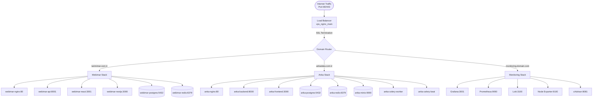

# ============================================================================
# VPS Infrastructure Architecture Documentation
# Complete system overview and component relationships
# ============================================================================

## 🏗️ Architecture Overview



## 🌐 Network Architecture

### External Access Points
- **HTTP**: Port 80 → Redirect to HTTPS
- **HTTPS**: Port 443 → SSL Termination at nginx_main
- **Monitoring**: Port 8080 → Health checks only

### SSL/TLS Configuration
- **Certificate Authority**: Let's Encrypt (auto-renewal)
- **SSL Termination**: Infrastructure nginx only
- **Internal Communication**: HTTP (no SSL overhead)
- **HSTS**: Enabled with 1-year max-age
- **Security Headers**: XSS, CSRF, frame protection

### Domain Routing
```nginx
# tarimimar.com.tr
location / → webimar-nginx:80
location /api → webimar-api:8001  
location /hesaplama → webimar-react:3001

# ankadata.com.tr  
location / → anka-frontend:3000
location /api → anka-backend:8000
location /minio → anka-minio:9000
```

## 🐳 Container Architecture

### Webimar Services (Resource Optimized)
| Service | Image Size | Memory | CPU | Purpose |
|---------|------------|--------|-----|---------|
| webimar-api | ~300MB | 200MB | 0.1 | Django REST API |
| webimar-nginx | ~50MB | 10MB | 0.05 | Static files, routing |
| webimar-nextjs | ~200MB | 100MB | 0.1 | SSG frontend |
| webimar-react | ~50MB | 80MB | 0.05 | SPA calculator |
| webimar-postgres | - | 100MB | 0.1 | Database |
| webimar-redis | - | 20MB | 0.05 | Cache |

### Anka Services (Full Stack)
| Service | Memory | Purpose |
|---------|--------|---------|
| anka-backend | 200MB | Django API |
| anka-frontend | 100MB | Next.js UI |
| anka-postgres | 150MB | Primary database |
| anka-redis | 50MB | Cache + Celery broker |
| anka-celery-worker | 150MB | Background tasks |
| anka-celery-beat | 50MB | Task scheduler |
| anka-minio | 100MB | Object storage |

### Infrastructure Services
| Service | Purpose | Exposed Ports |
|---------|---------|---------------|
| nginx_main | SSL termination, routing | 80, 443, 8080 |
| certbot | SSL certificate renewal | - |
| prometheus | Metrics collection | 9090 |
| grafana | Dashboard visualization | 3001 |
| loki | Log aggregation | 3100 |
| cadvisor | Container metrics | 8081 |

## 📊 Data Flow

### Request Processing
1. **Internet** → nginx_main (SSL termination)
2. **Domain routing** → Service-specific nginx
3. **Load balancing** → Application containers
4. **Database queries** → PostgreSQL containers
5. **Caching** → Redis containers
6. **Response** → Client (with security headers)

### Monitoring Data Flow
1. **Applications** → Prometheus metrics export
2. **Containers** → cAdvisor metrics collection
3. **Logs** → Promtail → Loki aggregation  
4. **System** → Node Exporter metrics
5. **Visualization** → Grafana dashboards
6. **Alerting** → Prometheus rules → Notifications

## 💾 Data Persistence

### Volume Mapping
```yaml
# Webimar Data
webimar_postgres_data: /var/lib/postgresql/data
webimar_redis_data: /data
webimar_api_staticfiles: /app/staticfiles
webimar_api_media: /app/media

# Anka Data  
anka_postgres_data: /var/lib/postgresql/data
anka_redis_data: /data
anka_minio_data: /data

# Infrastructure
nginx_ssl_certs: /etc/letsencrypt
nginx_logs: /var/log/nginx
prometheus_data: /prometheus
grafana_data: /var/lib/grafana
loki_data: /loki
```

### Backup Strategy
- **Local Backup**: 3 days retention
- **FTP Remote**: 30 days retention  
- **Frequency**: Daily (databases), Weekly (full system)
- **Automation**: Cron-based with monitoring

## 🔒 Security Architecture

### Network Security
- **No exposed database ports** (5432, 6379 internal only)
- **Firewall**: Only 22, 80, 443, 8080 exposed
- **SSL/TLS**: A+ grade configuration
- **Rate limiting**: Per-service limits configured

### Application Security  
- **Secret management**: Environment variables
- **CORS**: Strict origin policies
- **CSRF**: Token validation enabled
- **XSS**: Content Security Policy headers
- **SQL Injection**: ORM parameterized queries

### Container Security
- **Non-root users**: All containers run as non-root
- **Minimal images**: Alpine-based where possible
- **Read-only**: File systems where applicable
- **Secrets**: No hardcoded credentials

## ⚡ Performance Optimizations

### Nginx Optimizations
- **Worker processes**: CPU-optimized (auto-detect)
- **Worker connections**: 4096 per worker
- **Proxy caching**: 100MB cache zones
- **Gzip compression**: Level 6, optimized types
- **Keep-alive**: Connection pooling enabled

### Database Optimizations
- **Connection pooling**: Application-level pooling
- **Query optimization**: Indexed queries, EXPLAIN analysis
- **Cache strategy**: Redis caching for frequent queries
- **Backup**: Incremental backups, minimal downtime

### Docker Optimizations
- **Multi-stage builds**: 70% size reduction
- **Layer caching**: Optimized Dockerfile order
- **Resource limits**: Memory and CPU limits set
- **Health checks**: Proactive failure detection

## 📈 Scaling Strategy

### Horizontal Scaling
- **Load balancing**: nginx upstream configuration ready
- **Database**: Read replicas configurable
- **Cache**: Redis clustering support
- **CDN**: Static asset distribution ready

### Vertical Scaling
- **Resource monitoring**: Prometheus alerts configured
- **Auto-scaling triggers**: CPU/Memory thresholds
- **Performance metrics**: Response time tracking
- **Bottleneck identification**: Detailed metrics collection

## 🔧 Maintenance Procedures

### Automated Tasks (Crontab)
- **02:00**: Daily database backups
- **03:00**: Weekly full system backup  
- **06:00**: SSL certificate checks
- **08:00**: Disk space monitoring
- **Monthly**: Image updates and service restarts

### Manual Procedures
- **Deployment**: Blue-green deployment strategy
- **Rollback**: Version-tagged containers
- **Scaling**: Docker Compose scaling commands
- **Debugging**: Centralized logging via Loki

This architecture provides enterprise-grade reliability, security, and scalability while maintaining operational simplicity and cost-effectiveness.