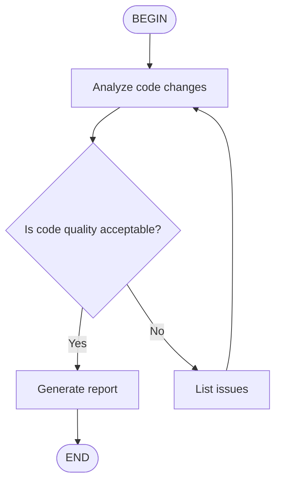

# Kimi Code CLI — Skills Sistemi

> [[kimi-code-cli|Ana Kimi CLI sayfasına dön]]

## Skills

### Skill Discovery (Keşif Sırası)

**Built-in** → paket içi (`kimi-cli-help`, `skill-creator`).

**User-level** (tüm projelerde geçerli):
- **Brand group** (birbirini dışlar, öncelikli):
  1. `~/.kimi/skills/`
  2. `~/.claude/skills/`
  3. `~/.codex/skills/`
- **Generic group** (birbirini dışlar):
  1. `~/.config/agents/skills/` (önerilen)
  2. `~/.agents/skills/`

İki grup bağımsız aranır, sonuçlar merge edilir. Aynı isimde skill varsa brand group önceliklidir.

`merge_all_available_skills = true` config ile tüm brand dizinleri yüklenir (öncelik: kimi > claude > codex). Generic group etkilenmez.

**Project-level** (sadece o proje):
- Brand group: `.kimi/skills/` → `.claude/skills/` → `.codex/skills/`
- Generic group: `.agents/skills/`

Ek dizin: `--skills-dir /path/to/skills` (birden fazla kez kullanılabilir, auto-discovered dizinleri override eder).

> `KIMI_SHARE_DIR` skill arama yollarını etkilemez. Skill'ler cross-tool yetenek uzantılarıdır (Kimi CLI, Claude, Codex ile uyumlu).

### Creating a Skill

Skill oluşturmak için sadece bir `SKILL.md` dosyası yeterlidir:

```
skills-dir/
└── my-skill/
    ├── SKILL.md          # Zorunlu
    ├── scripts/          # Opsiyonel
    ├── references/       # Opsiyonel
    └── assets/           # Opsiyonel
```

**SKILL.md formatı** — YAML frontmatter + Markdown:
```markdown
---
name: code-style
description: My project's code style guidelines
---

## Code Style

In this project, please follow these conventions:
- Use 4-space indentation
- Variable names use camelCase
```

**Frontmatter alanları:**

| Alan | Açıklama | Zorunlu |
|------|----------|---------|
| `name` | 1-64 karakter, küçük harf/rakam/tire; atlanırsa dizin adı | Hayır |
| `description` | 1-1024 karakter; atlanırsa "No description provided." | Hayır |
| `license` | Lisans adı/dosya | Hayır |
| `compatibility` | Ortam gereksinimleri, max 500 karakter | Hayır |
| `metadata` | Ek key-value | Hayır |

**Best practices:**
- `SKILL.md` 500 satırın altında tut
- Detaylı içerik `scripts/`, `references/`, `assets/` dizinlerine taşı
- Göreceli yollar kullan
- Adım adım talimatlar, input/output örnekleri, edge case açıklamaları

### Flat `.md` Skills

Skill dizinine doğrudan yerleştirilen tek bir `.md` dosyası da skill olarak tanınır. İsmi `.md` uzantısı hariç dosya adıdır.

```
~/my-skills-collection/
├── demo-ui-components.md    # flat: name = "demo-ui-components"
└── deploy/                   # subdirectory: name = "deploy"
    └── SKILL.md
```

Aynı dizinde aynı isimde hem flat `.md` hem alt dizin varsa alt dizin kazanır.

### Description Resolution

Skill tanımlaması (description) aşağıdaki zincirle çözülür:

1. Frontmatter `description:` alanı (tercih edilen)
2. Body'nin ilk boş olmayan satırı (fallback; 240 karakterde kesilir)
3. `"No description provided."` (son çare)

### Extra Skill Dizinleri

Auto-discovered built-in / user / project dizinlerinin üzerine ek dizinler eklemek için config'te `extra_skill_dirs` kullanılır:

```toml
extra_skill_dirs = [
    "~/my-skills-collection",
    ".claude/plugins/my-skills",
    "/opt/team-shared/skills",
]
```

Her giriş absolute path, `~` ile başlayan path veya proje root'a göre relative path olabilir. Var olmayan girişler sessizce atlanır. Bu dizinlerden keşfedilen skill'ler `Extra` scope'unda gruplanır.

### Slash Commands ile Skill Yükleme

`/skill:<name>` slash command'ı sık kullanılan prompt şablonlarını skill olarak kaydedip hızlıca çağırmayı sağlar:

```
/skill:code-style
/skill:git-commits fix user login issue
```

Komutun ardına eklenen metin skill prompt'una kullanıcının spesifik isteği olarak eklenir.

Normal konuşmalarda Agent context'e göre otomatik olarak skill içeriğini okumaya karar verir, manuel çağrı gerekmez.

### Flow Skills

`type: flow` frontmatter + Mermaid/D2 diyagramı ile multi-step workflow tanımlanır.

```markdown
---
name: code-review
description: Code review workflow
type: flow
---


```

**D2 formatı:**
```
BEGIN -> B -> C
B: Analyze existing code
C: Review if design doc is detailed enough
C -> B: No
C -> D: Yes
D: Start implementation
D -> END
```

**Çalıştırma:**
- `/flow:<name>` — Flow'u otomatik çalıştırır (BEGIN → END)
- `/skill:<name>` — Sadece SKILL.md içeriğini prompt olarak gönderir (flow çalıştırılmaz)

Flow diyagramlarında bir `BEGIN` ve bir `END` node zorunludur. Decision node'lar `<choice>branch name</choice>` output'u bekler.

## Skills vs Plugins vs MCP

| Mekanizma | Amaç | Format | Trigger |
|-----------|------|--------|---------|
| **Skills** | Bilgi tabanlı rehberler | `SKILL.md` | AI context'e göre okur |
| **Plugins** | Çalıştırılabilir yerel araçlar | `plugin.json` + script'ler | AI tool çağrısı |
| **MCP** | Harici sürekli çalışan servisler | `mcp.json` | AI tool çağrısı (cross-process) |
| **Hooks** | Yaşam döngüsü otomasyonu | `config.toml` + shell | Event tabanlı |

**Seçim rehberi:**
- Kod stili, workflow, best practice → **Skill**
- Basit script wrapper, proje özel araç → **Plugin**
- Karmaşık tool orkestrasyonu, browser/database kontrolü → **MCP**
- Güvenlik kontrolü, formatlama, bildirim → **Hook**
