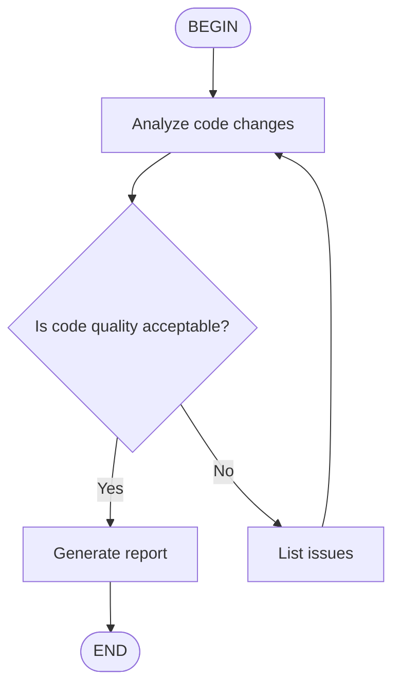

# [[Kimi Code CLI]]

Terminal tabanlı AI kodlama asistanı. Projelerde kod yazma, wiki yönetimi, deploy otomasyonu ve agent bazlı görev yönlendirme için kullanılır.

## Purpose

Monorepo ve alt projelerde:
- Kod değişiklikleri, refactor ve yeni özellik
- [[proactive-wiki|Wiki ingest]] ve güncelleme (`wiki topla`, `wiki güncelle`)
- Shell komutları ve otomasyon
- Agent bazlı görev yönlendirme ve routing

## Installation

```bash
# Linux / macOS
curl -LsSf https://code.kimi.com/install.sh | bash

# uv ile (önerilen)
uv tool install --python 3.13 kimi-cli
```

Python 3.12–3.14 destekler. İlk çalıştırmada `/login` ile OAuth yapılandırılır.

## Configuration

### Overrides and Precedence

Config öncelik sırası (yüksekten düşüğe):

1. **Environment variables** — Geçici override'lar, CI/CD
2. **CLI parameters** — Başlangıçta belirtilen parametreler
3. **Configuration file** — `~/.kimi/config.toml` veya `--config-file` ile belirtilen

### CLI Parameters

| Parameter | Açıklama |
|-----------|----------|
| `--config <TOML/JSON>` | Config içeriğini doğrudan geçir |
| `--config-file <PATH>` | Config dosyası yolu (varsayılan yerine) |
| `--model, -m <NAME>` | Model adı belirt |
| `--thinking` | Thinking mode aç |
| `--no-thinking` | Thinking mode kapat |
| `--yolo, --yes, -y` | Tüm operasyonları otomatik onayla |
| `--plan` | Plan modunda başla |
| `--agent <NAME>` | Built-in agent seç (`default`, `okabe`) |
| `--agent-file <PATH>` | Custom agent YAML dosyası yükle |
| `--skills-dir <PATH>` | Ek skill dizini ekle (birden fazla kez kullanılabilir) |

`--config` ve `--config-file` birlikte kullanılamaz.

`--thinking` / `--no-thinking` son session'dan kaydedilen thinking state'i override eder. Belirtilmezse son session'ın durumu kullanılır.

`--plan` yeni session'larda plan modu açar. Mevcut session resume edilirken force plan modu yapar. Config dosyasında `default_plan_mode = true` ile varsayılan plan modu ayarlanabilir.

### Environment Variables

| Provider Tipi | Env Değişkenleri |
|---------------|------------------|
| `kimi` | `KIMI_API_KEY`, `KIMI_BASE_URL`, `KIMI_MODEL_NAME` |
| `openai_legacy` / `openai_responses` | `OPENAI_API_KEY`, `OPENAI_BASE_URL`, … |

Diğer provider tiplerinde env override desteklenmez.

Örnek:
```bash
KIMI_API_KEY="sk-xxx" KIMI_MODEL_NAME="kimi-for-coding" kimi
```

### Config Priority Örneği

Varsayım: `~/.kimi/config.toml` şu şekilde:
```toml
default_model = "kimi-for-coding"

[providers.kimi-for-coding]
type = "kimi"
base_url = "https://api.kimi.com/coding/v1"
api_key = "sk-config"

[models.kimi-for-coding]
provider = "kimi-for-coding"
model = "kimi-for-coding"
max_context_size = 262144
```

| Senaryo | `base_url` | `api_key` | `model` |
|---------|-----------|-----------|---------|
| `kimi` | Config file | Config file | Config file |
| `KIMI_API_KEY=sk-env kimi` | Config file | **Env** | Config file |
| `kimi --model other` | Config file | Config file | **CLI param** |
| `KIMI_MODEL_NAME=kimi-for-coding kimi` | Config file | Config file | **Env** |

## Core Operations

| Mod | Açıklama |
|-----|----------|
| Agent | AI'a gönder, varsayılan mod |
| Shell | Terminal komutları doğrudan (`Ctrl-X`) |
| Plan | Sadece okuma, plan yazma (`Shift-Tab`) |
| Print | Non-interactive, script/CI (`--print`) |

**Onaylar ve YOLO**: Dosya değişikliği ve shell komutları onay ister. `--yolo` tümünü otomatik onaylar.

**Background Tasks**: Uzun komutlar arka planda çalışır (`run_in_background=true`). `/task` ile yönetilir.

**Context**: Session devam ettirme (`--continue`, `-r`), export/import, compact/clear.

## Skills

### Skill Discovery (Keşif Sırası)

**Built-in** → paket içi (`kimi-cli-help`, `skill-creator`).

**User-level** (tüm projelerde geçerli):
- **Brand group** (birbirini dışlar, öncelikli):
  1. `~/.kimi/skills/`
  2. `~/.claude/skills/`
  3. `~/.codex/skills/`
- **Generic group** (birbirini dışlar):
  1. `~/.config/agents/skills/` (önerilen)
  2. `~/.agents/skills/`

İki grup bağımsız aranır, sonuçlar merge edilir. Aynı isimde skill varsa brand group önceliklidir.

`merge_all_available_skills = true` config ile tüm brand dizinleri yüklenir (öncelik: kimi > claude > codex). Generic group etkilenmez.

**Project-level** (sadece o proje):
- Brand group: `.kimi/skills/` → `.claude/skills/` → `.codex/skills/`
- Generic group: `.agents/skills/`

Ek dizin: `--skills-dir /path/to/skills` (birden fazla kez kullanılabilir, auto-discovered dizinleri override eder).

> `KIMI_SHARE_DIR` skill arama yollarını etkilemez. Skill'ler cross-tool yetenek uzantılarıdır (Kimi CLI, Claude, Codex ile uyumlu).

### Creating a Skill

Skill oluşturmak için sadece bir `SKILL.md` dosyası yeterlidir:

```
skills-dir/
└── my-skill/
    ├── SKILL.md          # Zorunlu
    ├── scripts/          # Opsiyonel
    ├── references/       # Opsiyonel
    └── assets/           # Opsiyonel
```

**SKILL.md formatı** — YAML frontmatter + Markdown:
```markdown
---
name: code-style
description: My project's code style guidelines
---

## Code Style

In this project, please follow these conventions:
- Use 4-space indentation
- Variable names use camelCase
```

**Frontmatter alanları:**

| Alan | Açıklama | Zorunlu |
|------|----------|---------|
| `name` | 1-64 karakter, küçük harf/rakam/tire; atlanırsa dizin adı | Hayır |
| `description` | 1-1024 karakter; atlanırsa "No description provided." | Hayır |
| `license` | Lisans adı/dosya | Hayır |
| `compatibility` | Ortam gereksinimleri, max 500 karakter | Hayır |
| `metadata` | Ek key-value | Hayır |

**Best practices:**
- `SKILL.md` 500 satırın altında tut
- Detaylı içerik `scripts/`, `references/`, `assets/` dizinlerine taşı
- Göreceli yollar kullan
- Adım adım talimatlar, input/output örnekleri, edge case açıklamaları

### Flow Skills

`type: flow` frontmatter + Mermaid/D2 diyagramı ile multi-step workflow tanımlanır.

```markdown
---
name: code-review
description: Code review workflow
type: flow
---


```

**D2 formatı:**
```
BEGIN -> B -> C
B: Analyze existing code
C: Review if design doc is detailed enough
C -> B: No
C -> D: Yes
D: Start implementation
D -> END
```

**Çalıştırma:**
- `/flow:<name>` — Flow'u otomatik çalıştırır (BEGIN → END)
- `/skill:<name>` — Sadece SKILL.md içeriğini prompt olarak gönderir (flow çalıştırılmaz)

Flow diyagramlarında bir `BEGIN` ve bir `END` node zorunludur. Decision node'lar `<choice>branch name</choice>` output'u bekler.

### Skills vs Plugins

| Mekanizma | Amaç | Format |
|-----------|------|--------|
| **Skills** | Bilgi tabanlı rehberler | `SKILL.md` — AI okur ve uygular |
| **Plugins** | Çalıştırılabilir araçlar | `plugin.json` — AI doğrudan tool çağrır |

Skills: kod stili, workflow, best practice tanımları için.
Plugins: script, API call, database query wrapper'ları için.

## Sub-agents and Agent System

### Built-in Agents

| Agent | Amaç | Aktif Tool'lar |
|-------|------|----------------|
| `default` | Genel kullanım | Agent, AskUserQuestion, SetTodoList, Shell, ReadFile, ReadMediaFile, Glob, Grep, WriteFile, StrReplaceFile, SearchWeb, FetchURL, EnterPlanMode, ExitPlanMode, TaskList, TaskOutput, TaskStop |
| `okabe` | Deneysel | `default` + SendDMail |

Seçim: `kimi --agent default` veya `kimi --agent okabe`

### Custom Agent Files

YAML formatında. `kimi --agent-file /path/to/my-agent.yaml`

```yaml
version: 1
agent:
  name: my-agent
  system_prompt_path: ./system.md
  tools:
    - "kimi_cli.tools.shell:Shell"
    - "kimi_cli.tools.file:ReadFile"
```

**Inheritance (extend):**
```yaml
version: 1
agent:
  extend: default
  system_prompt_path: ./my-prompt.md
  exclude_tools:
    - "kimi_cli.tools.web:SearchWeb"
```

**Alanlar:**

| Alan | Açıklama | Zorunlu |
|------|----------|---------|
| `extend` | Miras alınacak agent (`default` veya relative path) | Hayır |
| `name` | Agent adı | Evet (miras yoksa) |
| `system_prompt_path` | System prompt dosyası (agent dosyasına göre relative) | Evet (miras yoksa) |
| `system_prompt_args` | System prompt'a özel argümanlar (merge edilir) | Hayır |
| `tools` | Tool listesi (`module:ClassName`) | Evet (miras yoksa) |
| `exclude_tools` | Hariç tutulacak tool'lar | Hayır |
| `subagents` | Subagent tanımları | Hayır |

### System Prompt Variables

System prompt Markdown template'dir. `${VAR}` ve Jinja2 `` destekler.

| Değişken | Açıklama |
|----------|----------|
| `${KIMI_NOW}` | Şu anki zaman (ISO format) |
| `${KIMI_WORK_DIR}` | Çalışma dizini |
| `${KIMI_WORK_DIR_LS}` | Çalışma dizini dosya listesi |
| `${KIMI_AGENTS_MD}` | Birleştirilmiş `AGENTS.md` içeriği (proje root'tan çalışma dizinine kadar, `.kimi/AGENTS.md` dahil). Detaylar: bkz. [[agents-md]] |
| `${KIMI_SKILLS}` | Yüklenen skill listesi |
| `${KIMI_ADDITIONAL_DIRS_INFO}` | `--add-dir` ile eklenen dizinler |

Özel argümanlar: `system_prompt_args:` ile tanımlanır, `${MY_VAR}` olarak kullanılır.

```yaml
agent:
  system_prompt_args:
    MY_VAR: "custom value"
```

### Defining Subagents

Agent dosyasında `subagents:` bölümü ile tanımlanır:

```yaml
version: 1
agent:
  extend: default
  subagents:
    coder:
      path: ./coder-sub.yaml
      description: "Handle coding tasks"
    reviewer:
      path: ./reviewer-sub.yaml
      description: "Code review expert"
```

Subagent dosyası da standart agent formatıdır, genellikle ana agent'dan miras alır:

```yaml
# coder-sub.yaml
version: 1
agent:
  extend: ./agent.yaml
  system_prompt_args:
    ROLE_ADDITIONAL: |
      You are now running as a subagent...
```

### Built-in Subagent Types

| Tip | Amaç | Aktif Tool'lar |
|-----|------|----------------|
| `coder` | Genel yazılım mühendisliği | Shell, ReadFile, Glob, Grep, WriteFile, StrReplaceFile, SearchWeb, FetchURL |
| `explore` | Hızlı read-only codebase keşfi | Shell, ReadFile, Glob, Grep, SearchWeb, FetchURL (yazma yok) |
| `plan` | Implementasyon planlama ve mimari tasarım | ReadFile, Glob, Grep, SearchWeb, FetchURL (Shell yok, yazma yok) |

**Kural:** Tüm subagent tipleri `Agent` tool'unu kullanamaz (nesting yasak). Sadece root agent `Agent` tool'una sahiptir.

### How Subagents Run

`Agent` tool'u ile başlatılır. İzole context, kendi context history'sini korur. `subagents/<agent_id>/` altında session dizininde saklanır. Resume edilebilir.

Avantajları:
- İzole context, ana agent conversation history'sini kirletmez
- Birden fazla bağımsız görev paralel işlenebilir
- Hedeflenmiş system prompt'lar
- Persistent instance'lar çoklu çağrı arasında context korur

**Agent Tool Parametreleri:**

| Parametre | Tip | Açıklama |
|-----------|-----|----------|
| `description` | string | Kısa görev açıklaması (3-5 kelime) |
| `prompt` | string | Detaylı görev tanımı |
| `subagent_type` | string | Built-in tip: `coder`, `explore`, `plan` (varsayılan: `coder`) |
| `model` | string | Opsiyonel model override |
| `resume` | string | Mevcut instance ID ile resume et |
| `run_in_background` | bool | Arka planda çalıştır (varsayılan: false) |

## Customization

- **MCP**: Harici araçlar (`kimi mcp add`). Config: `~/.kimi/mcp.json`.
- **Hooks**: Shell komut öncesi/sonrası betikler (beta).
- **Plugins**: `plugin.json` ile çalıştırılabilir araçlar (beta).

## Usage in Projects

| Proje | Kullanım |
|-------|----------|
| `local` monorepo | Wiki ingest, proje yönetimi |
| `ops-bot` | Kod değişiklikleri, agent routing |
| `mathlock-play` | Backend geliştirme |
| `telegram-kimi` | Bot geliştirme |

## Data Locations

| Dizin | İçerik |
|-------|--------|
| `~/.kimi/` | Config, sessions, logs |
| `~/.kimi/sessions/` | Oturum geçmişi |
| `~/.kimi/skills/` | Kullanıcı seviyesi skill'ler |
| `~/.kimi/mcp.json` | MCP sunucu yapılandırması |
| `.kimi/skills/` | Proje seviyesi skill'ler |

## Kaynaklar

- Kimi Code CLI Docs — Configuration Overrides: https://www.kimi.com/code/docs/en/kimi-code-cli/configuration/overrides-and-precedence.html
- Kimi Code CLI Docs — Skills: https://www.kimi.com/code/docs/en/kimi-code-cli/customization/skills.html
- Kimi Code CLI Docs — Sub-agents: https://www.kimi.com/code/docs/en/kimi-code-cli/customization/sub-agents.html

